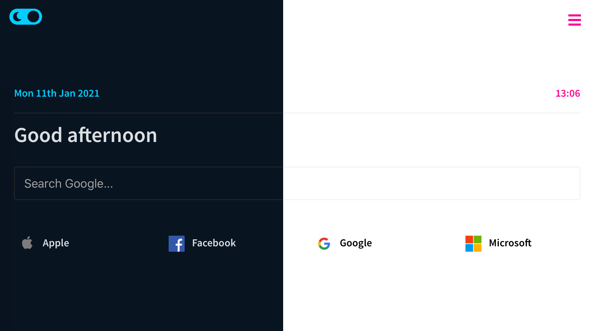

# Startpage

A super simple and customisable landing page.

[](https://github.com/adhamu/startpage/actions)



## Assumptions

Hosted on [Netlify](https://netlify.com)

## Features

- Personalise with your name
- Search with [Google](https://www.google.co.uk), [DuckDuckGo](https://duckduckgo.com) or [Startpage](https://www.startpage.com) including [search suggestions](#search-suggestions)
- Dark Mode
- Customisable theme
- Bookmarks
- Weather

## Technology Stack

- Typescript
- IndexedDB
- React
- Emotion Styled Components

## Serverless Functions

Serverless functions are a part of this project. This means you need to deploy to an environment that supports these such as [Netlify Functions](https://www.netlify.com/products/functions/).

## Tooling

- ESLint
- Prettier
- Parcel

## Installation

### Clone the repository

```sh
$ git clone https://github.com/adhamu/startpage
$ cd startpage
```

## Install Dependencies

```sh
$ yarn
```

## Run it locally

```sh
$ yarn start
```

Open up [http://localhost:8888](http://localhost:8888)

## Building for production

```sh
$ yarn build
```

This will output everything to the `/dist` directory which is where you would point your webserver to. Alternatively, you could host this with Netlify or Github Pages

## Linting

```sh
$ yarn lint
```

## Weather

In order to enable the weather capability, you need to sign up for an API key at [https://openweathermap.org](https://openweathermap.org). Once you have done that, create an `.env` file in the root of the project as follows.

```sh
$ cp .env.example .env
```

```sh
OPEN_WEATHER_API_KEY=YOUR_API_KEY
```
